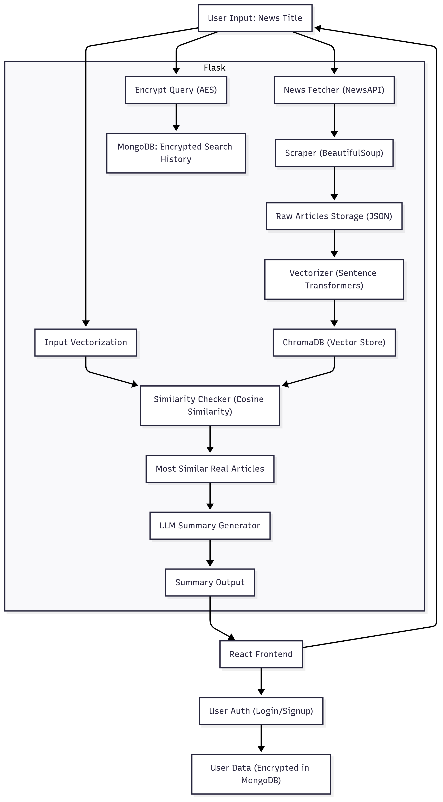

#  Fake News Detection System

A secure, modular, and real-time system for detecting fake news using semantic similarity, vector embeddings, LLM summarization, and encrypted user behavior profiling.

##  Project Overview

This project aims to combat the spread of misinformation by verifying the authenticity of news articles in real-time. Unlike spam messages, fake news does not follow predictable patterns — it often looks legitimate but lacks factual consistency. Our system checks news content against real articles using NLP, provides a confidence score, and offers encrypted user history tracking.

##  Key Features

- Real-time fake news verification with confidence scoring  
- News comparison using semantic similarity and vector embeddings  
- LLM-generated summaries to explain classification  
- Encrypted storage of user search queries and login credentials  
- User behavior profiling (while preserving privacy)  
- Modular backend architecture and fully functional frontend  

## Architecture

